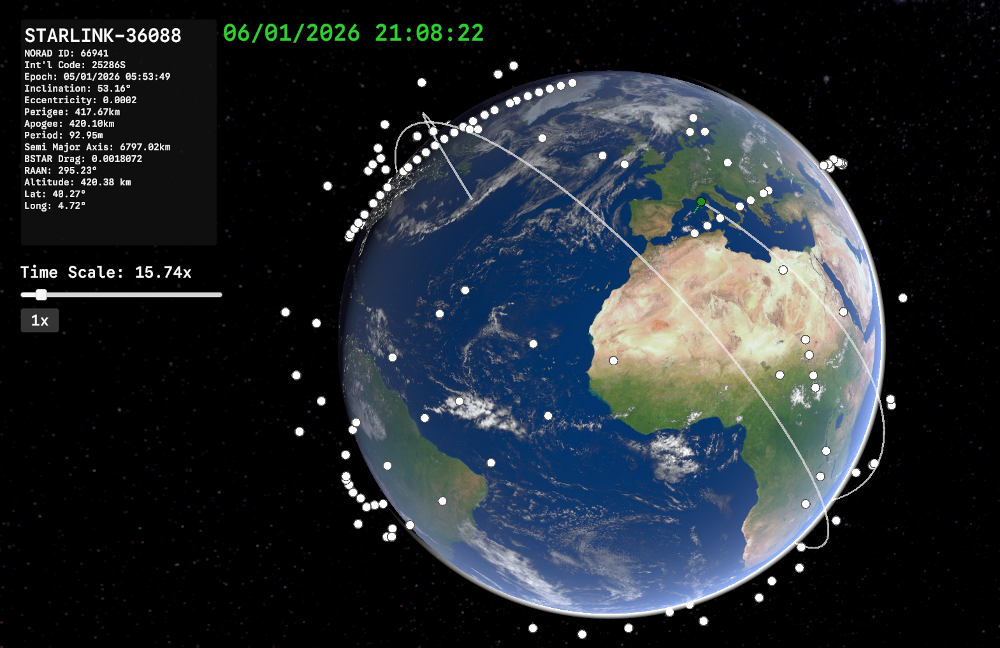
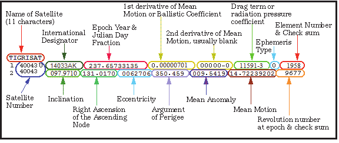
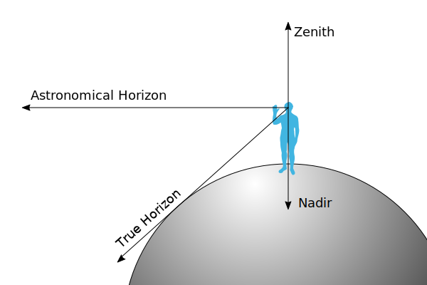

# Sat_Tracker

This project is a real-time satellite tracking simulation in Unitythat parses TLE data of satellites that have been launched in the past 30 days and uses a SGP4 library for orbit propagation that allow the visualisation of live orbit paths, nadir points and metrics such as Perigee, Apogee, Inclination and live altitudes along an ECEF(Earth-centred, Earth-fixed coordinate system). It also features a controllable simulation clock, bridging the gap between aerospace data and interactive 3D environments built in Unity.

# Tools

## TLE
 
TLE is used to encode orbital data of satellites at a set time with parameters such as the satellite's Norad No.,Apogee, Perigee, Eccentricity, Inclination etc thus enabling predictions of their past or future positions using models such as SGP. There are several sites that provied TLE data of satellites and I found out that celestrak.org provides a good list of easy to use TLE elements such as all currently active satellites, NOAA satellites etc. For this project, I primarily used the list of satellites that have been launched in the last 30 days. Also SO to Dr. T.S. Kelso for running Celestrak. its a cool site.

## SGP
SGP(Simplified General Pertuberation) Models are mathamatical models that are used to calculate the orbital postion of satellites based on TLE data. I used a an implementation of SGP4 by parzivail called SGP.NET to do most of the orbit calculations.

## Utility Class
 
the Utility class is a wrapper for the SGP.NET  library for Unity that allowd me to make some easliy reuseable functions that help convert stuff like geodesic cooridinates into Unity Vector3 Postions. I also added additional methods such as the abilty to caluclate the Nadir point of a satellite on the surface of the earth.

## Improvements
+ The main performance hurdle is the calculation and rendering of several satellites. Since each satellite has its own update loop which calculates its respective position, rotation and scale with respect to the camera and is all done on the main CPU thread. The code could be modified to use Unity's ECS and GPU instancing to help parallise some of the computation on either the GPU or CPU threads

## References
+ [SGP.NET by parzivail](https://github.com/parzivail/SGP.NET)
+ [Wikipedia - Two-line element set](https://en.wikipedia.org/wiki/Two-line_element_set)
+ [Wikipedia - Simplified perturbations models](https://en.wikipedia.org/wiki/Simplified_perturbations_models)
+ [Wikipedia - Earth-centered inertial](https://en.wikipedia.org/wiki/Earth-centered_inertial)
+ [Celestrak.org](https://celestrak.org/NORAD/elements/)
+ [Earth Model- Earth Rendering Free by Multicrash](https://assetstore.unity.com/packages/vfx/shaders/earth-rendering-free-54914)

